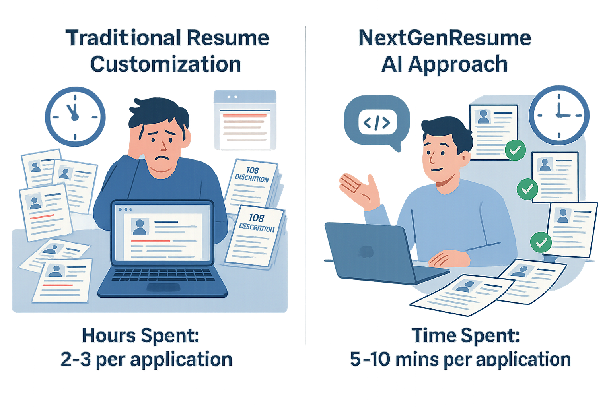
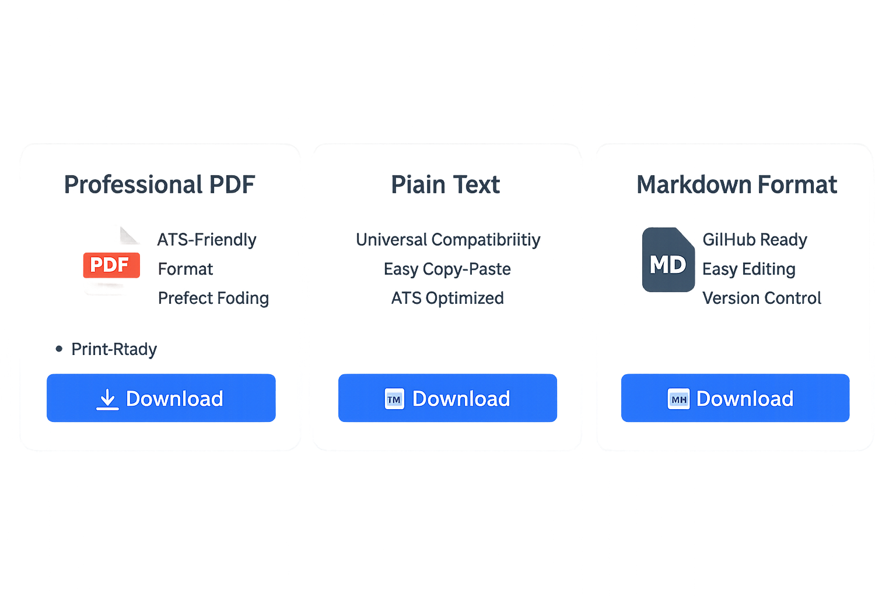
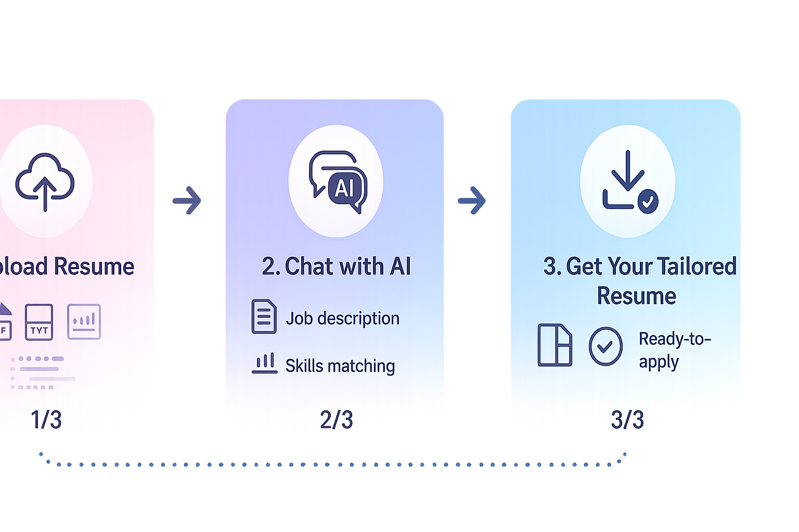

# NextGenResume: Your AI-Powered Resume Companion 🚀

Ever found yourself spending hours tweaking your resume for different job applications? You're not alone! In today's competitive job market, having a perfectly tailored resume for each position is crucial - but it shouldn't eat up your valuable time. Enter NextGenResume, your intelligent resume assistant! ✨

## The Problem We're Solving 🎯

Let's face it:
- 😫 Customizing resumes for each job application is exhausting
- ⏰ Hours spent reformatting and rephrasing content
- 🎯 Missing out on opportunities due to non-optimized resumes
- 📊 Struggling to highlight relevant skills for each position

<!-- Image Specification for pain-points.png -->
<!--
Create a split-screen comparison image:

LEFT SIDE - "Traditional Method" (showing frustration)
- Title: "Traditional Resume Customization"
- Visual elements:
  * Stressed person surrounded by multiple paper resumes
  * Clock showing time pressure (11:59 PM)
  * Multiple tabs open on computer screen
  * Red highlights showing manual edits
  * Stack of job descriptions
  * "Hours Spent: 2-3 per application"

RIGHT SIDE - "NextGenResume Solution" (showing efficiency)
- Title: "NextGenResume AI Approach"
- Visual elements:
  * Relaxed person chatting with AI
  * Single base resume being transformed
  * Multiple tailored versions flowing out
  * Green checkmarks showing automation
  * Clock showing quick process (5 mins)
  * "Time Spent: 5-10 mins per application"

Style:
- Modern, flat design
- Professional color scheme (blues, whites, accent colors)
- Clear visual hierarchy
- Size: 1200x800px
- Format: PNG with transparent background
- Use icons and infographic elements
-->

*Traditional resume customization vs NextGenResume approach*

## Introducing NextGenResume: Your Resume, Reimagined 🌟

NextGenResume is an AI-powered platform that revolutionizes how you create and customize resumes. Powered by OpenAI's GPT-4, it's like having a professional resume writer at your fingertips - available 24/7!

### Key Features:

#### 1. Chat-Based Resume Customization 💬
Simply upload your base resume and chat with our AI about the job requirements. Watch as it crafts a perfectly tailored version of your resume in real-time!

<!-- Image Specification for chat-demo.gif -->
<!--
Create an animated GIF showing the chat interface in action:

Duration: 15-20 seconds total
Frame rate: 24 fps
Resolution: 800x600px

Sequence of scenes:

1. Upload Scene (2-3 seconds)
   - Show drag-and-drop area
   - Animate a resume file being dropped
   - Show success checkmark animation
   - Filename: "my_resume.pdf"

2. Chat Interaction (8-10 seconds)
   - User types: "I'm applying for a Senior Software Engineer position at Google"
   - AI responds: "I'll help tailor your resume for this role. What are the key requirements?"
   - User types: "They need experience with cloud computing and machine learning"
   - Show typing indicators between messages
   - AI response shows analyzing animation

3. Real-time Updates (4-5 seconds)
   - Split screen showing:
     * Chat on the left
     * Resume preview on right
   - Highlight changes being made in real-time
   - Show skills being emphasized
   - Green highlights for added/modified content

4. Final Result (2-3 seconds)
   - Show completed tailored resume
   - Success message: "Your resume is now optimized for the position!"
   - Download button appears with subtle animation

Style Elements:
- Modern chat interface design
- Streamlit's color scheme (primary blue: #FF4B4B)
- Smooth transitions between scenes
- Typing indicators for authenticity
- Subtle hover effects
- Professional font (Inter or similar)
- Light/Dark mode compatible

Technical Specifications:
- Format: Animated GIF
- Size: < 5MB (optimize for web)
- Colors: Match Streamlit's theme
- Smooth easing for animations
- Include subtle shadows for depth
-->

*Real-time resume customization through natural conversation*

#### 2. Lightning-Fast Customization ⚡
- Upload once, customize infinitely
- Generate multiple versions in minutes
- Perfect for applying to multiple positions

#### 3. Smart Format Handling 📄
- Automatic formatting
- Multiple export options (PDF, TXT, Markdown)
- Professional templates built-in

<!-- Image Specification for export-options.png -->
<!--
Create a modern interface showing export options:

Layout: Horizontal cards layout
Resolution: 800x400px
Format: PNG with transparent background

Export Option Cards (left to right):

1. PDF Export Card
   - Icon: PDF file icon
   - Title: "Professional PDF"
   - Features listed:
     * ATS-Friendly Format
     * Perfect Formatting
     * Print-Ready
   - Download button with PDF icon
   - Subtle shadow and hover effect

2. TXT Export Card
   - Icon: TXT file icon
   - Title: "Plain Text"
   - Features listed:
     * Universal Compatibility
     * Easy Copy-Paste
     * ATS Optimized
   - Download button with TXT icon
   - Matching style with first card

3. Markdown Export Card
   - Icon: MD file icon
   - Title: "Markdown Format"
   - Features listed:
     * GitHub Ready
     * Easy Editing
     * Version Control
   - Download button with MD icon
   - Consistent styling with other cards

Style Elements:
- Streamlit's color scheme
- Rounded corners (8px radius)
- Subtle gradients
- Professional typography
- Hover animations
- Clear CTAs
-->

*Multiple export formats available with one click*

## See It In Action 🎥

Watch how easy it is to create multiple tailored resumes in minutes:

<iframe width="560" height="315" src="assets/product-demo.mp4" frameborder="0" allowfullscreen></iframe>

## How It Works 🛠️

1. **Upload Your Resume** 📤
   - Support for PDF, DOCX, and TXT formats
   - Instant parsing and processing

2. **Chat with AI** 💡
   - Share job descriptions
   - Discuss specific requirements
   - Get instant customizations

3. **Download & Apply** 🎉
   - One-click downloads
   - Multiple format options
   - Ready to submit!

<!-- Image Specification for workflow.png -->
<!--
Create a modern workflow diagram:

Layout: Horizontal timeline flow
Resolution: 1200x400px
Format: PNG with transparent background

Step 1: Upload (Left Section)
- Large circular icon: Cloud upload symbol
- Title: "1. Upload Resume"
- Animated arrow pointing right
- Supporting icons:
  * PDF, DOCX, TXT file types
  * Parsing animation
- Progress indicator: 1/3

Step 2: AI Conversation (Center Section)
- Large circular icon: Chat bubbles with AI symbol
- Title: "2. Chat with AI"
- Animated arrows on both sides
- Supporting elements:
  * Job description icon
  * Skills matching visualization
  * Real-time analysis indicator
- Progress indicator: 2/3

Step 3: Download (Right Section)
- Large circular icon: Download symbol with checkmark
- Title: "3. Get Your Tailored Resume"
- Supporting icons:
  * Multiple format options
  * Success checkmark
  * Ready-to-apply badge
- Progress indicator: 3/3

Connecting Elements:
- Flowing arrows between steps
- Dotted path underneath
- Progress tracking line

Style:
- Use Streamlit's color palette
- Gradient backgrounds
- Smooth corners
- Professional icons
- Clear typography
- Subtle animations
- Light hover effects

Additional Details:
- Add micro-interactions on hover
- Include progress indicators
- Use consistent spacing
- Maintain visual hierarchy
- Ensure accessibility with clear contrast
-->

*Simple 3-step process to your perfect resume*

## Built with Modern Technology 🔧

Our stack ensures reliability, security, and speed:
- 🎨 **Streamlit** - For a smooth, responsive UI
- 🧠 **OpenAI GPT-4** - Advanced AI processing
- 🔐 **Supabase** - Secure data handling
- 🚀 **Render** - Reliable hosting

## Ready to Transform Your Job Search? 🎯

Stop spending hours on resume customization. Let NextGenResume help you:
- ✅ Apply to more positions
- ✅ Save countless hours
- ✅ Increase your interview chances
- ✅ Stand out from the crowd

  <a href="https://nextgencv-builder.streamlit.app/" target="_blank">Try NextGenResume Now - It's Free!</a>

## The Numbers Speak for Themselves 📊

- 🕒 Average time saved per application: 45 minutes
- 📈 Increased response rate from recruiters
- 💪 More confidence in job applications

[Insert Image: Success metrics visualization]

---

### Start Your Journey to Better Applications Today! 🚀

Visit [NextGenResume](https://nextgencv-builder.streamlit.app/) and transform how you approach job applications. Because your time is better spent preparing for interviews than formatting resumes!

  <a href="https://nextgencv-builder.streamlit.app/" target="_blank">Create Your First AI-Powered Resume</a>

---

*Have questions? Want to learn more? Drop a comment below or reach out to our team!* 💌

